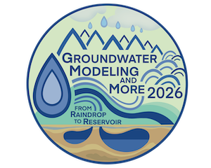

# MODFLOW 6 and FloPy: Take Your Modeling Skills to the Next Level
Training materials for the [MODFLOW 6 and FloPy workshop](https://igwmc.princeton.edu/groundwater-modeling-and-more/short-courses-more/#MODFLOW-6-and-FloPy) offered at the [2026 Groundwater Modeling and More Conference](https://igwmc.princeton.edu/groundwater-modeling-and-more/) at Princeton University.  

Presentations from the workshop will be provided as a GitHub Release, and can be accessed [here](https://github.com/langevin-usgs/modflow-training-princeton2026/releases).

## Location and Dates
* Princeton University
* June 5-6, 2026

## Course Description
MODFLOW 6 is the current version of MODFLOW released and supported by the USGS.  The program is under active development by the short course instructors and the broader hydrologic community.  This short course introduces participants to MODFLOW 6 and its growing simulation capabilities.  For each topic included in the short course, there will be a short lecture on the underlying concepts and implementation followed by a live demonstration.  Live demonstrations will use the Python language, Jupyter Notebooks, and the FloPy Package to create, run, and post-process MODFLOW 6 simulations. 

The following topics will be covered during the short course.
*	Getting started with MODFLOW 6 and FloPy
*   Using AI to build MODFLOW models
*	Mesh generation with FloPy
*   Coupling models using exchanges
*	Parallel MODFLOW 6 simulations
*	Advanced packages (Multi-Aquifer Well, Streamflow Routing, Lake, Unsaturated Zone Flow, Water Mover, and Compaction and SUBsidence)
*	Particle tracking with MODFLOW 6
*   Solute and heat transport
*	Variable-density flow
*	XT3D multi-point flux approximation for modeling aquifers with full three-dimensional anisotropy
*	MODFLOW Application Programming Interface (API) for coupling models, creating custom MODFLOW packages, and controlling MODFLOW during a simulation

## Intended Audience
This course is suited for groundwater modelers interested in learning about the USGS version of MODFLOW, its newer capabilities, and how to use FloPy to create and run simulations.  For attendees wanting to run live demonstrations, instructions for installing the required software on a laptop computer (Windows, Mac, and Linux operating systems will be supported) are provided [here](./SOFTWARE.md).  No previous experience with FloPy or Python is required, however, participants without any Python experience may benefit from additional preparation prior to the class.

## Instructors
* Wes Bonelli, University Corporation for Atmospheric Research
* Joe Hughes, INTERA Incorporated
* Chris Langevin, S.S. Papadopulos & Associates, Inc.
* Josh Larsen, US Geological Survey
* Sorab Panday, GSI Environmental Inc.
* Alden Provost, US Geological Survey
* Michael Reno, University Corporation for Atmospheric Research
* Martijn Russcher, Deltares

## Agenda

The following tentative agenda is based on a start time each morning of 8:00 AM and an ending time each day of 5:00 PM.

### Friday, June 5, 2026

|Time      |Topic                            |Lead                        |
|----------|---------------------------------|----------------------------|
| 8:00 AM  |Introductions and Overview       |Langevin                    |
| 8:45 AM  |First FloPy Model                |Hughes                      |
|10:00 AM  |Using AI to Build MODFLOW Models |Russcher                    |
|10:45 AM  |--*BREAK*--                      | --                         |
|11:15 AM  |Mesh generation with FloPy       |Larsen                      |
|12:00 PM  |--*LUNCH*--                      | --                         |
| 1:15 PM  |Multi-Model Coupling             |Langevin/Russcher           |
| 1:45 PM  |Parallel MODFLOW                 |Russcher/Hughes/Larsen      |
| 2:45 AM  |--*BREAK*--                      | --                         |
| 3:00 PM  |Advanced Flow Packages           |Hughes                      |
| 4:00 PM  |Particle Tracking in MODFLOW 6   |Bonelli/Provost                      |
| 5:00 PM  |ADJOURN                          |                            |

### Saturday, June 6, 2026

|Time      |Topic                            |Lead                        |
|----------|---------------------------------|----------------------------|
| 8:00 AM  |Solute and Heat Transport        | Langevin/Panday            |
| 9:30 AM  |Variable Density Flow            | Langevin/Panday            |
|10:30 AM  |--*BREAK*--                      | --                         |
|10:45 AM  |XT3D                             | Provost                    |
|11:30 AM  |MODFLOW API                      | Hughes/Russcher/Larsen     |
|12:15 PM  |--*LUNCH*--                      | --                         |
| 1:30 PM  |MODFLOW API (cont)               | Hughes/Russcher/Larsen     |
| 3:00 AM  |--*BREAK*--                      | --                         |
| 3:30 PM  |NetCDF                           | Reno                       |
| 4:00 PM  |FloPy 4                          | Bonelli/Reno/Larsen        |
| 4:30 PM  |Future Directions and Wrapup     | All                        |
| 5:00 PM  |ADJOURN                          |                            |

## Software

This workshop consists of jupyter notebooks that use FloPy to create, run, and post-process MODFLOW models.  In order for workshop attendees to follow along and run the notebooks, software must be installed prior to the workshop.  Click [here](./SOFTWARE.md) for software installation instructions.

## Binder

If the software installation failed, it may be possible to run the jupyter notebooks using mybinder.org.  Click the button below to start an online version of the jupyter notebooks.

[![badge](https://img.shields.io/badge/launch-binder-579ACA.svg?logo=data:image/png;base64,iVBORw0KGgoAAAANSUhEUgAAAFkAAABZCAMAAABi1XidAAAB8lBMVEX///9XmsrmZYH1olJXmsr1olJXmsrmZYH1olJXmsr1olJXmsrmZYH1olL1olJXmsr1olJXmsrmZYH1olL1olJXmsrmZYH1olJXmsr1olL1olJXmsrmZYH1olL1olJXmsrmZYH1olL1olL0nFf1olJXmsrmZYH1olJXmsq8dZb1olJXmsrmZYH1olJXmspXmspXmsr1olL1olJXmsrmZYH1olJXmsr1olL1olJXmsrmZYH1olL1olLeaIVXmsrmZYH1olL1olL1olJXmsrmZYH1olLna31Xmsr1olJXmsr1olJXmsrmZYH1olLqoVr1olJXmsr1olJXmsrmZYH1olL1olKkfaPobXvviGabgadXmsqThKuofKHmZ4Dobnr1olJXmsr1olJXmspXmsr1olJXmsrfZ4TuhWn1olL1olJXmsqBi7X1olJXmspZmslbmMhbmsdemsVfl8ZgmsNim8Jpk8F0m7R4m7F5nLB6jbh7jbiDirOEibOGnKaMhq+PnaCVg6qWg6qegKaff6WhnpKofKGtnomxeZy3noG6dZi+n3vCcpPDcpPGn3bLb4/Mb47UbIrVa4rYoGjdaIbeaIXhoWHmZYHobXvpcHjqdHXreHLroVrsfG/uhGnuh2bwj2Hxk17yl1vzmljzm1j0nlX1olL3AJXWAAAAbXRSTlMAEBAQHx8gICAuLjAwMDw9PUBAQEpQUFBXV1hgYGBkcHBwcXl8gICAgoiIkJCQlJicnJ2goKCmqK+wsLC4usDAwMjP0NDQ1NbW3Nzg4ODi5+3v8PDw8/T09PX29vb39/f5+fr7+/z8/Pz9/v7+zczCxgAABC5JREFUeAHN1ul3k0UUBvCb1CTVpmpaitAGSLSpSuKCLWpbTKNJFGlcSMAFF63iUmRccNG6gLbuxkXU66JAUef/9LSpmXnyLr3T5AO/rzl5zj137p136BISy44fKJXuGN/d19PUfYeO67Znqtf2KH33Id1psXoFdW30sPZ1sMvs2D060AHqws4FHeJojLZqnw53cmfvg+XR8mC0OEjuxrXEkX5ydeVJLVIlV0e10PXk5k7dYeHu7Cj1j+49uKg7uLU61tGLw1lq27ugQYlclHC4bgv7VQ+TAyj5Zc/UjsPvs1sd5cWryWObtvWT2EPa4rtnWW3JkpjggEpbOsPr7F7EyNewtpBIslA7p43HCsnwooXTEc3UmPmCNn5lrqTJxy6nRmcavGZVt/3Da2pD5NHvsOHJCrdc1G2r3DITpU7yic7w/7Rxnjc0kt5GC4djiv2Sz3Fb2iEZg41/ddsFDoyuYrIkmFehz0HR2thPgQqMyQYb2OtB0WxsZ3BeG3+wpRb1vzl2UYBog8FfGhttFKjtAclnZYrRo9ryG9uG/FZQU4AEg8ZE9LjGMzTmqKXPLnlWVnIlQQTvxJf8ip7VgjZjyVPrjw1te5otM7RmP7xm+sK2Gv9I8Gi++BRbEkR9EBw8zRUcKxwp73xkaLiqQb+kGduJTNHG72zcW9LoJgqQxpP3/Tj//c3yB0tqzaml05/+orHLksVO+95kX7/7qgJvnjlrfr2Ggsyx0eoy9uPzN5SPd86aXggOsEKW2Prz7du3VID3/tzs/sSRs2w7ovVHKtjrX2pd7ZMlTxAYfBAL9jiDwfLkq55Tm7ifhMlTGPyCAs7RFRhn47JnlcB9RM5T97ASuZXIcVNuUDIndpDbdsfrqsOppeXl5Y+XVKdjFCTh+zGaVuj0d9zy05PPK3QzBamxdwtTCrzyg/2Rvf2EstUjordGwa/kx9mSJLr8mLLtCW8HHGJc2R5hS219IiF6PnTusOqcMl57gm0Z8kanKMAQg0qSyuZfn7zItsbGyO9QlnxY0eCuD1XL2ys/MsrQhltE7Ug0uFOzufJFE2PxBo/YAx8XPPdDwWN0MrDRYIZF0mSMKCNHgaIVFoBbNoLJ7tEQDKxGF0kcLQimojCZopv0OkNOyWCCg9XMVAi7ARJzQdM2QUh0gmBozjc3Skg6dSBRqDGYSUOu66Zg+I2fNZs/M3/f/Grl/XnyF1Gw3VKCez0PN5IUfFLqvgUN4C0qNqYs5YhPL+aVZYDE4IpUk57oSFnJm4FyCqqOE0jhY2SMyLFoo56zyo6becOS5UVDdj7Vih0zp+tcMhwRpBeLyqtIjlJKAIZSbI8SGSF3k0pA3mR5tHuwPFoa7N7reoq2bqCsAk1HqCu5uvI1n6JuRXI+S1Mco54YmYTwcn6Aeic+kssXi8XpXC4V3t7/ADuTNKaQJdScAAAAAElFTkSuQmCC)](https://mybinder.org/v2/gh/langevin-usgs/modflow-training-princeton2026/HEAD)

## Groundwater Modeling and More 2026

This workshop is part of the [Groundwater Modeling and More Conference](https://igwmc.princeton.edu/groundwater-modeling-and-more/).

